**Operations Data Analyst at NielsenIQ.** I work on the part of analytics most people skip: deciding whether a number is allowed to leave the building.

At NielsenIQ I own the quality gate every project passes before hand-over — the rules, the thresholds, and the Python/VBA suite that runs them at 20%, 50% and 90% of fieldwork. In 11 months: **41,037 samples checked**, minor error **6% → 2%**, major error held at a **0.2% median against a 5% ceiling**, project issue rate **−30%**.

Outside work I build the pipelines behind the analysis — Spark at 10M rows, Kafka streaming, fraud rule design, portfolio analytics.

---

**Now** · data quality rules, automation, agentic AI workflows
**Next** · credit risk and payments analytics

---

<!--LIVE:start-->

_The live block — what moved recently, CI status, twelve weeks of commits and the language split — is written here by [`scripts/refresh.py`](scripts/refresh.py) on the first run of the workflow, then every morning after that._

<!--LIVE:end-->

---

### Two of these you can actually play with

Not a screenshot — a page where you move the thresholds and watch the answer change.

| | |
|---|---|
| **[Voucher abuse detection](https://nhmtri.github.io/voucher-abuse-detection/)** | Nine abuse pairs are planted in the data. Move the four rule thresholds and the page scores you: how many rings caught, how many ordinary customers swept in with them. |
| **[RFM segmentation](https://nhmtri.github.io/rfm-segmentation-sql/)** | Drag the cut-offs; the grid recolours, the revenue split moves, and the SQL rewrites itself underneath. |

### Selected work

| Project | What it does | Result |
|---|---|---|
| [voucher-abuse-detection](https://github.com/nhmTri/voucher-abuse-detection) | Pair-level network rules on campaign transactions | Closed ring of **3 buyers, 3 sellers** on 1-VND orders, at **100% precision** against the planted truth |
| [rfm-segmentation-sql](https://github.com/nhmTri/rfm-segmentation-sql) | RFM scoring with CTEs and window functions, every cut-off a parameter | Champions spend **39% more** at the same frequency |
| [Job_realtime](https://github.com/nhmTri/Job_realtime) | Kafka → Spark Streaming → Cassandra → MySQL, with CDC and Grafana | 2 live sources, postings visible in minutes, fully replayable |
| [FPT_processing_bigdata](https://github.com/nhmTri/FPT_processing_bigdata) | Staged Spark batch over nested JSON | 10M rows → 1M OLAP rows in **under 250s** |

Full case studies, with the analysis and the reasoning: **[portfolio](https://portfolionhmtri.netlify.app)**

---

No client data, client names or client figures appear in any repository here. Every dataset used is public, synthetic, or my own.

📫 nguyenhoangminhtri1410@gmail.com
